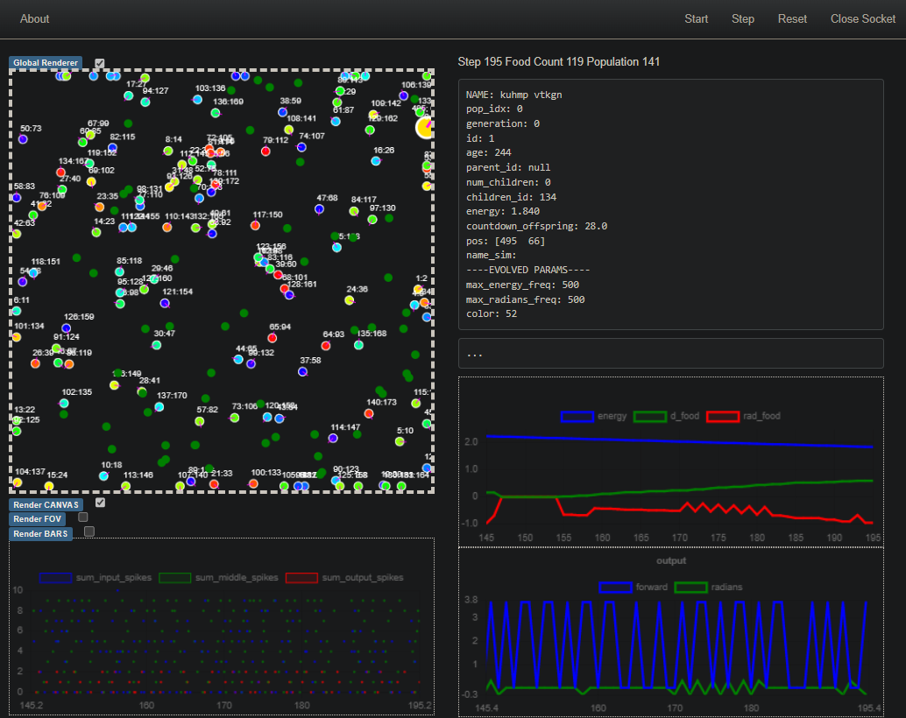

# Evo Spike: Food Foraging 


**A food foraging environment, multi-agents, with spiking network, where many agents' paramenters (including their neural networks) are evolved.**

There are two main environments. One is multiprocess, and uses all available cores in your system. The other one is single core. In most situation multiprocess is what you want. In the multiprocess setup, each agent is spawned on a different process, and the `Environment` object is taked with syncing them. 

# Getting started
### Requirements
You need my library for creating a dashboard in the browser:
```
pip install git+https://github.com/ValerioB88/browser-dashboard.git    
```
and my fork of BindsNet:
```
pip install git+https://github.com/ValerioB88/bindsnet.git
```

plus some standard libraries:

`pip install fastapi "uvicorn[standard]" torch pandas numpy sty tqdm dill torchvision pandas`

### Installation
To install you can _either_:
- run `pip install git+https://github.com/ValerioB88/browser-dashboard.git`

**OR**
- clone/fork the repo, then install in editable mode (do this if you plan to change stuff): `pip -e {cloned folder}`  
  
### Run Example:

```
cd EvoSpike_FoodForaging
python -m src.food_foraging_multiprocess.main --gfx
```
Where `--gfx` indicates that a browser visualizer is gonna be open. As indicated in the terminal, open `localhost:8000` (or whatever port is available), and you should be presented with the graphical interface. The visualization generally makes the simulation much slower, but you can press `F` on the keyboard to only update the graphics every 100 frames and speed everything up. In any case, if you don't care about the graphics, do not use the `--gfx` option. 

### This is a work in progress. It might not work out of the box. Please contact me if you need further instruction to get started!
